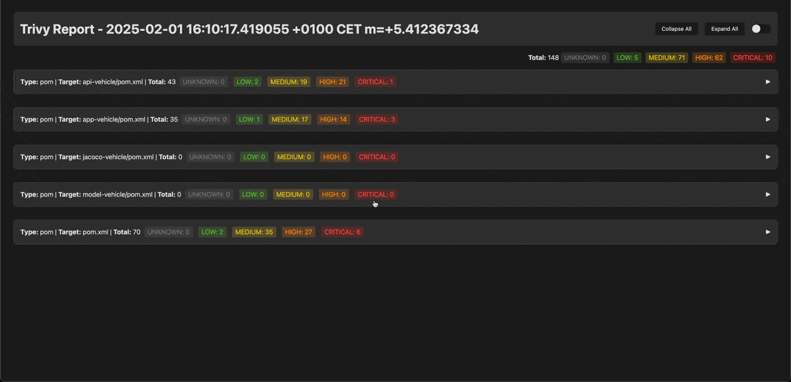

# 🌟 Enhanced Trivy HTML Template

🚀 **A modern, feature-rich HTML report template for [Trivy](https://github.com/aquasecurity/trivy)!**

Trivy is a powerful vulnerability scanner for containers, Kubernetes, and code repositories. This repository provides a significantly improved HTML report template that enhances readability, usability, and interactivity.

## ✨ Features

- 🎨 **Modern and sleek design** - Upgraded UI for better readability and aesthetics.
- 📊 **Total vulnerability summary** - Get a quick overview of all detected vulnerabilities.
- 📑 **Section-wise breakdown** - Easily navigate through categorized vulnerabilities.
- 🔽 **Collapsible nodes** - Expand or collapse all vulnerability sections with a single click.
- 🌗 **Dark mode & Light mode support** - Seamless viewing experience in both themes.

## 📷 Screenshots



## 📦 Installation & Usage

1. Install Trivy (if not already installed):
   ```sh
   brew install aquasecurity/trivy/trivy  # macOS
   sudo apt install trivy                 # Debian/Ubuntu
   ````
   More installation methods: [Trivy Docs](https://aquasecurity.github.io/trivy/v0.45/getting-started/installation/)

2. Run a scan and generate an HTML report with the enhanced template:
   ```sh
   trivy image --format template --template @enhanced-template.tpl -o report.html your-image-name
   ```

3. Open `report.html` in your browser to explore the enhanced visualization.

## 🚀 Contributing

Contributions are welcome! Feel free to submit a pull request or open an issue.

## 📜 License

This project is licensed under the [MIT License](LICENSE).

## ❤️ Support

If you like this project, consider giving it a ⭐ on GitHub!

---

🔗 **Learn more about Trivy:**
- [Trivy GitHub Repository](https://github.com/aquasecurity/trivy)
- [Trivy Documentation](https://aquasecurity.github.io/trivy/)

